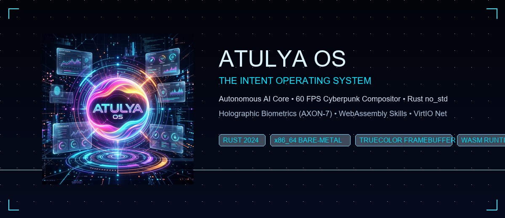
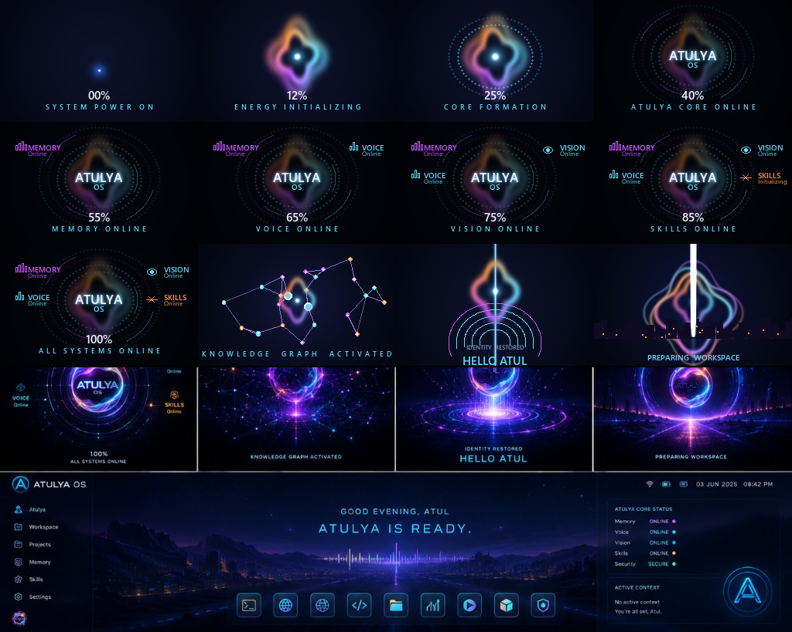

<div align="center">



# 🌌 ATULYA OS
### *The Next-Generation Intent Operating System*

[](https://www.rust-lang.org/)
[](https://github.com/atulyaai/Atulya-OS)
[](https://github.com/atulyaai/Atulya-OS)
[](LICENSE)

*A freestanding, memory-safe, multi-layered x86_64 operating system built in pure Rust (`no_std`). Fuses macOS floating glass aesthetics, Linux command power, Windows window compositing, and an autonomous AI core.*

---

</div>

## 📖 About Atulya OS

**Atulya OS** is an autonomous "Intent Computer" designed from the ground up to unify AI autonomy with bare-metal operating system architecture. Built from scratch without existing OS kernels, it runs in **x86_64 Long Mode** on a double-buffered 1080p TrueColor linear framebuffer.

### 🌟 Core Architectural Pillars

```
┌─────────────────────────────────────────────────────────────┐
│                 ATULYA AI INTENT & ORB UI                  │
│       (Reactive Waveform, Biometric Gate, Holographic HUD)  │
├─────────────────────────────────────────────────────────────┤
│                 AUTONOMOUS WASM SKILLS ENGINE               │
│     (Memory Graph, Voice Engine, Vision Stream, Sandboxing) │
├─────────────────────────────────────────────────────────────┤
│               DESKTOP & GLASS WINDOW COMPOSITOR             │
│        (9-App Floating Dock, Draggable Windows, Terminal)   │
├─────────────────────────────────────────────────────────────┤
│                    RUST NO_STD KERNEL                       │
│    (Preemptive Scheduler, Memory Paging, VFS, VirtIO Net)   │
├─────────────────────────────────────────────────────────────┤
│                     HARDWARE / QEMU                         │
│       (x86_64 Long Mode, Framebuffer, PIT, 8259 PIC, PCI)   │
└─────────────────────────────────────────────────────────────┘
```

1. **Bare-Metal Rust Safety**: 100% written in `no_std` Rust with SIMD (SSE/SSE2) enabled, spinlock-safe scheduling, and zero undefined behavior.
2. **AAA 60 FPS Cyberpunk Boot Sequence**: Vector orbital HUD dials, 48 converging quantum particles, 3D anti-aliased holographic hero orb, and razor-thin plasma progress bar.
3. **Holographic Biometric Login Gate**: Hexagonal fingerprint scanner with real-time biometric touch detection and live clearance telemetry (`AXON-7`).
4. **Panoramic Desktop Compositor**:
   - Top banner greeting with animated real-time audio visualizer waveform.
   - 9-app floating frosted glass dock (`Terminal`, `Web`, `Mesh`, `Code`, `File`, `Stats`, `Media`, `3D`, `Security`).
   - Draggable, focusable, and closeable glass window manager.
5. **PC Speaker Sound Synthesizer**: Direct hardware tone generator via PIT Channel 2 (Ports `0x43`, `0x42`, `0x61`) playing signature rising cyberpunk harmonic boot chimes and UI clicks.
6. **WebAssembly Skills Runtime**: Sandboxed bytecode execution engine (`\0asm` v1) with stack machine evaluation.
7. **PCI Bus Scanner & Network Stack**: Configuration space enumerator with VirtIO-Net adapter and packet telemetry.
8. **Hierarchical RAMDisk / VFS**: Unix-like filesystem (`/user/atul`, `/system`, `/apps`, `/home`).

---

## 🖼️ Visual Storyboard & Architecture

<div align="center">



</div>

---

## ⚡ Interactive Terminal Commands

Once booted into the desktop, open the **Terminal** window to run native commands:

| Command | Description |
| :--- | :--- |
| `help` | Display list of all kernel and userland commands |
| `pci` | Enumerate all discovered hardware devices on the PCI bus |
| `ps` | List live process table (PIDs, task names, and scheduling states) |
| `wasm` | Execute `/apps/quantum_skill.wasm` bytecode inside the sandbox |
| `ifconfig` | Inspect network interfaces (`lo0`, `eth0`) and MAC/IP settings |
| `ping <ip>` | Test network packet routing and ICMP round-trip latency |
| `sound` | Trigger the PC Speaker cyber harmonic synthesizer chime |
| `skills` | Inspect live AI subsystems (Memory, Voice, Vision, Skills, Security) |
| `ls [path]` | List files and directories in the VFS |
| `cat <file>` | Display contents of a file (e.g. `cat /user/atul/welcome.txt`) |
| `mkdir <dir>` | Create a new directory in the RAMDisk |
| `echo <text>` | Print text to terminal or redirect to files |
| `theme` | Cycle through 4 color themes (*Cyberpunk Cyan, Matrix Green, Obsidian, Retro Gold*) |
| `scan` | Run real-time circular radar sweep diagnostics |
| `matrix` | Launch holographic green digital rain stream |
| `neofetch` | Print kernel system specs and hardware monitor |
| `clear` | Clear the terminal display buffer |

---

## 🚀 Getting Started & Running

### Prerequisites
- **Rust Toolchain**: `nightly-x86_64-pc-windows-msvc` (or Linux equivalent) with `rust-src`
- **QEMU**: `qemu-system-x86_64`

### Quick Launch

In PowerShell:
```powershell
cd "Atulya OS"

# Build the complete OS image
cargo build

# Launch in QEMU with hardware acceleration
powershell -ExecutionPolicy Bypass -File .\scripts\run-qemu.ps1
```

---

## 📁 Repository Structure

```text
Atulya OS/
├── assets/
│   ├── images/
│   │   ├── banner.png           # Repository widescreen hero banner
│   │   ├── atulyaos_logo.png    # 1024x1024 master holographic orb logo
│   │   └── boot_storyboard.png  # Concept storyboard & panoramic view
│   └── boot/
│       ├── orb_hero.png         # Extracted 280x280 anti-aliased hero orb
│       └── orb_hero.rgba        # Embedded raw 32-bit RGBA sprite
├── docs/                        # Technical specifications & architecture
│   ├── architecture.md          # Multi-layer system design
│   ├── implementation-plan.md   # Roadmap and feature milestone tracking
│   └── input_system.md          # PS/2 hardware protocol specs
├── kernel/                      # Main OS Kernel (no_std Rust)
│   └── src/
│       ├── boot/awakening.rs    # 60 FPS AAA Cyberpunk boot animation
│       ├── desktop.rs           # Glass window compositor, dock, & terminal
│       ├── login.rs             # Biometric authorization gate (AXON-7)
│       ├── sound.rs             # PC Speaker PIT Channel 2 audio driver
│       ├── pci.rs               # PCI bus scanner & device enumerator
│       ├── wasm/runtime.rs      # WebAssembly bytecode execution sandbox
│       ├── interrupts.rs        # IDT, 8259 PIC, timer, keyboard/mouse IRQs
│       ├── scheduler.rs         # Preemptive multitasking process scheduler
│       ├── process.rs           # Process control blocks & context switching
│       ├── fs/ramdisk.rs        # Hierarchical Unix RAMDisk / VFS
│       ├── display.rs           # 1080p linear double-buffered graphics engine
│       ├── font.rs              # Bitmap typography & alpha text rendering
│       └── math.rs              # Fixed-point integer trigonometry
├── scripts/
│   ├── build.ps1                # Automated cargo compilation script
│   ├── run-qemu.ps1             # QEMU emulator launch script
│   └── generate_banner.py       # Banner generator
├── Cargo.toml                   # Root workspace manifest
└── x86_64-atulyaos.json         # Custom bare-metal target specification
```

---

<div align="center">

**Built with ❤️ for Atulya AI** • *Crafted in pure Rust*

</div>
