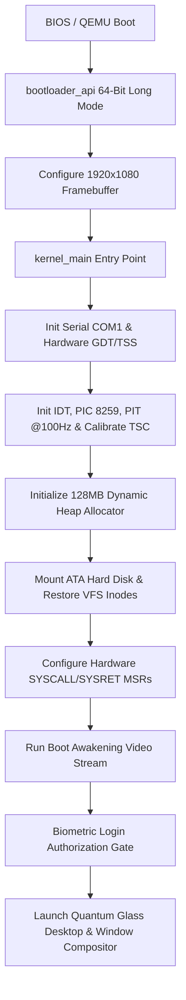

# AtulyaOS System Architecture

AtulyaOS is a sovereign, multi-layered x86_64 operating system written in freestanding Rust (`no_std`). It integrates hardware-enforced Ring 3 process isolation, persistent ATA storage, an autonomous AI intent engine, a sandboxed WebAssembly skill runtime, and a subpixel anti-aliased quantum glass compositor.

---

## 1. Directory Structure

```text
Atulya OS/
├── .cargo/                 # Cargo target configuration and runner options
├── assets/                 # Brand assets, font atlases, and icon sheets
│   ├── fonts/
│   │   └── font_16_alpha.bin   # 16px Segoe UI anti-aliased subpixel font atlas
│   └── icons/
│       └── dock_icons.rgba     # 9x 32x32 RGBA alpha dock icon sprite sheet
├── docs/                   # Architecture, roadmap, and technical specifications
│   ├── architecture.md     # System architecture & subsystem design (this document)
│   ├── ROADMAP.md          # 5-step engineering roadmap & syscall spec
│   ├── implementation-plan.md # Verified implementation plan & completed subsystems
│   └── input_system.md     # PS/2 keyboard & self-synchronizing mouse protocols
├── kernel/                 # Main OS Kernel (no_std Rust)
│   ├── src/
│   │   ├── main.rs         # Kernel entry point & subsystem initialization
│   │   ├── gdt.rs          # 64-bit GDT (Kernel/User Code & Data selectors) + TSS
│   │   ├── syscall.rs      # Hardware SYSCALL/SYSRET MSRs & naked assembly dispatcher
│   │   ├── interrupts.rs   # IDT, PIC 8259, PIT @100Hz, IRQ handlers, unified iretq stub
│   │   ├── process.rs      # Process model, Ring 0/Ring 3 5-value iretq frames & context restore
│   │   ├── scheduler.rs    # Preemptive round-robin scheduler & process table
│   │   ├── allocator.rs    # Dynamic 128MB linked-list heap allocator
│   │   ├── fs/
│   │   │   ├── ata.rs      # PIO LBA28/48 Primary Master IDE disk driver (Ports 0x1F0-0x1F7)
│   │   │   ├── ramdisk.rs  # Inode-based VFS with full on-disk serialization/deserialization
│   │   │   └── vfs.rs      # Unified FileSystem trait & directory entries
│   │   ├── viewer.rs       # Universal Format-Sniffing Viewer (PDF, PNG, BMP, WAV, MP3, WASM)
│   │   ├── wasm/
│   │   │   └── runtime.rs  # Standalone WebAssembly (\0asm v1) bytecode execution engine
│   │   ├── ai.rs           # Autonomous AI Intent Engine & Context Vector Graph
│   │   ├── desktop.rs      # Window manager, cubic easing animations, terminal & dock
│   │   ├── display.rs      # Framebuffer compositor & subpixel anti-aliased geometry
│   │   ├── font.rs         # Subpixel AA font renderer & 8x8 fallback
│   │   ├── gpu/
│   │   │   ├── effects.rs  # Floating-point trigonometric harmonic audio visualizer
│   │   │   └── shader.rs   # Float shader pipeline
│   │   ├── login.rs        # Biometric biometric gate with authentic CGI visualizer
│   │   ├── math.rs         # Fixed-point trig LUT & isqrt integer square root
│   │   ├── pci.rs          # PCI configuration space bus scanner
│   │   ├── serial.rs       # COM1 port debug logging
│   │   ├── sound.rs        # PIT Channel 2 cyber harmonic chime generator
│   │   └── timer.rs        # Hardware TSC calibration against PIT for real-ms timing
│   └── Cargo.toml          # Kernel dependencies
├── scripts/                # Utility scripts (run-qemu.ps1, generate_font_atlas.py)
└── Cargo.toml              # Workspace root definition
```

---

## 2. Boot & Execution Flow



---

## 3. Core Subsystems

### 🛡️ Hardware Privilege & SYSCALL Subsystem
- **GDT & TSS**: Sets up Kernel Code (`0x08`), Kernel Data (`0x10`), User Data (`0x18 | 3 = 0x1B`), User Code (`0x20 | 3 = 0x23`), and Task State Segment with `RSP0` kernel interrupt stack.
- **Hardware SYSCALL (`MSR IA32_STAR / LSTAR / FMASK`)**:
  - Direct zero-overhead kernel transitions via `syscall` / `sysretq`.
  - Supports `SYS_EXIT` (0), `SYS_PRINT` (1), `SYS_READ` (2), `SYS_WRITE` (3), `SYS_YIELD` (4), `SYS_GET_TICK` (5), `SYS_ALLOC` (6), and `SYS_INTENT` (7).
- **Unified 5-Value `iretq` Scheduler Dispatch**:
  - Both Kernel and User threads use the canonical 64-bit frame `[SS, RSP, RFLAGS, CS, RIP]`.
  - `restore_context` reloads registers and executes `iretq`, seamlessly switching between Ring 0 and Ring 3 without privilege escalation flaws.

### 💾 Persistent Storage (ATA + VFS)
- **ATA Block Driver (`fs/ata.rs`)**: Direct hardware I/O to primary IDE controller ports `0x1F0`–`0x1F7` supporting 28-bit LBA sector read/write.
- **VFS On-Disk Serialization (`fs/ramdisk.rs`)**:
  - Superblock magic `ATULYA_FS_V1` stored at LBA 2048.
  - Inode directory entries and payload sectors written consecutively by `sync_to_disk()` and deserialized on boot by `restore_from_disk()`.

### 📑 Universal Format-Sniffing File Viewer (`viewer.rs`)
- Sniffs file headers by magic bytes rather than extensions:
  - `%PDF-` -> PDF Vector Document Structure.
  - `\x89PNG`, `BM`, `qoif`, `\xFF\xD8\xFF` -> Raster Images (Dimensions, color depth, bpp).
  - `RIFF...WAVE`, `ID3` -> Audio PCM streams (Sample rate, channels, duration).
  - `\0asm` -> WebAssembly binary modules.
  - UTF-8 text -> JSON, Markdown, Source Code, Plain Text with line numbers.
  - Binary -> Hexadecimal memory dump with ASCII sidebar.

### 🧠 Autonomous AI Intent Engine (`ai.rs`)
- Natural language intent parser translating user queries into kernel operations:
  - Natural-language VFS search (`ask find <keyword>`, `ask where is ...`).
  - Large file disk usage analysis (`ask show large files`).
  - Automatic viewer dispatch (`ask open /docs/spec.pdf`).
  - Context Vector Graph tracking active knowledge nodes on the memory bus.

### 🎨 Quantum Glass Compositor & Subpixel Anti-Aliasing (`display.rs` & `font.rs`)
- **Subpixel Anti-Aliasing**: Smooth fractional alpha coverage on `circle_outline` and `rect_rounded_outline` corners using fixed-point Euclidean math (`math::isqrt`).
- **16px Segoe UI Atlas**: High-resolution anti-aliased typography (`font.rs`).
- **Window Motion Easing**: 200ms cubic scale and opacity easing when opening, closing, and restoring windows.
