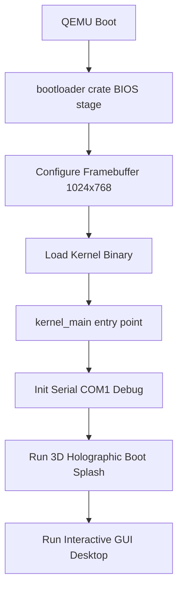

# AtulyaOS System Architecture

AtulyaOS is a freestanding, multi-layered x86_64 operating system written in Rust. It merges design elements from macOS (translucent bottom dock, clean top status bar with vector icons), Linux (interactive command shell), and Windows (tiling and float-draggable windows).

## Directory Structure

```text
Atulya OS/
├── .cargo/                 # Cargo target configuration and runner options
├── assets/                 # Brand assets and graphics
│   └── images/
│       └── atulyaos_logo.png # High-fidelity holographic OS logo
├── docs/                   # Architecture and technical documentation
│   ├── architecture.md     # System design & structure
│   └── input_system.md     # PS/2 Keyboard and Mouse protocol specifications
├── kernel/                 # Main OS Kernel (no_std Rust)
│   ├── src/
│   │   ├── boot_splash.rs  # 3D holographic boot animation
│   │   ├── desktop.rs      # Window manager, top bar, dock, and terminal
│   │   ├── display.rs      # Screen drawing primitives & alpha-blending
│   │   ├── font.rs         # 8x8 bitmap font engine
│   │   ├── main.rs         # Kernel entry point
│   │   ├── math.rs         # Fixed-point trig and helper math functions
│   │   └── serial.rs       # COM1 port debug logging
│   └── Cargo.toml          # Kernel dependencies
├── scripts/                # Utility scripts for building and launching
├── src/                    # Standard binary wrapper to launch QEMU
├── Cargo.toml              # Workspace definitions
└── x86_64-atulyaos.json    # Custom target specification file
```

## System Boot Flow



1. **Bootloader**: We use the Rust `bootloader` crate (v0.11) configured to boot in BIOS mode. It handles entering 64-bit long mode, setting up a 1024x768 framebuffer graphics console, and passing memory maps and boot info to our kernel.
2. **Boot Splash**: Performs a cinematic animation sequence:
   - 3D Holographic Core Orb: Radial glowing center with pulsating frequency.
   - Rotating 3D Wireframe Cube: Real-time 3D projection onto the 2D plane.
   - Wave nebula background, radar sweep, typewriter diagnostics, spectrum analyzer, and progress bar.
3. **Desktop**: Renders the desktop workspace consisting of:
   - Translucent top bar with battery, WiFi strength, and speaker volume icons.
   - Frosted glass bottom dock with glowing active indicators.
   - Draggable windows: Terminal console and System Monitor.

## Graphics & Rendering Pipeline

AtulyaOS draws directly to the hardware framebuffer. There is no GPU acceleration; all primitives are drawn by the CPU using highly optimized integer math:
- **`Display::pixel`**: Writes raw bytes (BGR/RGB/U8 formats) using memory stride and offset calculations.
- **`Display::rect_rounded_alpha`**: Performs simulated alpha blending by reading back destination pixels (`read_pixel`), performing a weighted average with the source color, adding dither noise for a frosted glass texture, and writing the result.
- **`Display::circle_outline`**: Bresenham's circle drawing algorithm.
- **`Display::draw_line`**: Bresenham's line drawing algorithm.
